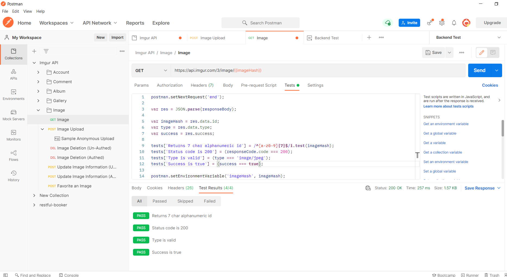

# Postman
### Автоматизация тестирования Imgur API
*Создание коллекции и тест-кейсов*

*Добавления картинки в избранное

*Получение картинки

*Обновление информации о картинке авторизованным и неавторизованным пользователем
.png)
test.png)
.png)
test.png)

*Загрузка картинки

*Удаление картинки авторизованным и неавторизованным пользователем
.png)
test.png)
.png)
test.png)